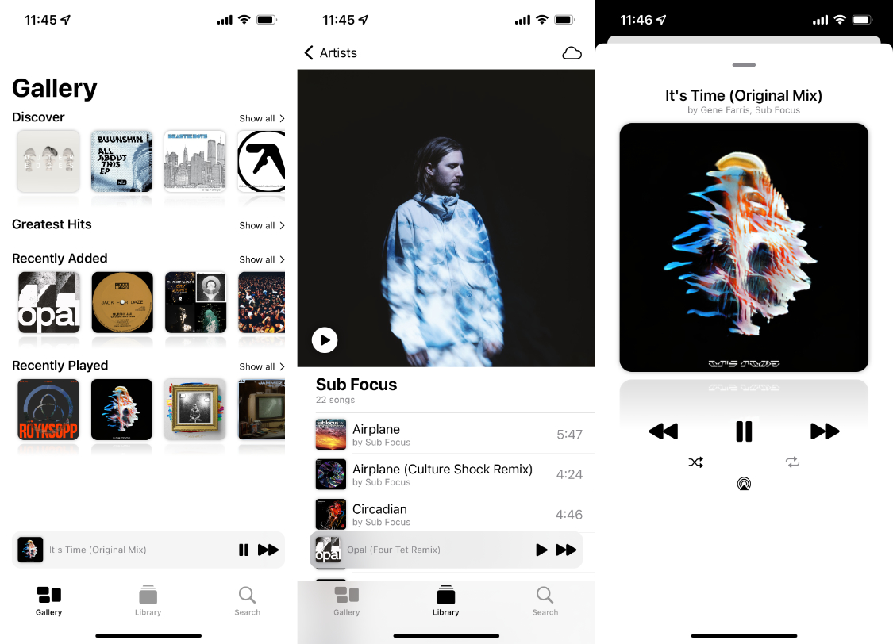

# Remastered

Remastered *was* meant to be a better and faster music client for iOS, based on you library in Music.app.

## Features

Remastered was meant to allow you to

* Discover rarely played music 💠
* View your recently added and played songs ✨
* Provide quick access to favorite albums and playlists ⭐️
* Search for music 🔍
* Use a build in library view similar to Music.app 📚
* Control your music via a now playing view ⏯

## Notes

* Remastered uses SwiftUI for its user interface and [TCA](https://github.com/pointfreeco/swift-composable-architecture) for its architecture
* To obtain an artist or playlist artwork I used a [private API](https://github.com/mrtnlst/remastered/blob/main/Remastered/Library/Extensions/MPMediaItemCollection%2BAdditions.swift#L32) of `MPMediaItemCollection` 
* Due to challenges with the `MediaPlayer` API I've decided to stop developing the project
